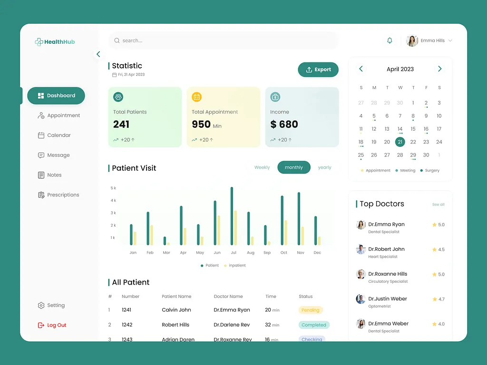

# 🏥 Medical Dashboard

A modern and responsive medical dashboard built with React, designed to help healthcare professionals manage patient information, appointments, medical statistics, and healthcare workflows through an intuitive and user-friendly interface.

## 🚀 Live Demo

👉 https://medicaldashboardd.netlify.app

## 📌 Overview

Medical Dashboard is a frontend web application that provides a clean and organized interface for managing healthcare-related data. The project focuses on usability, responsive design, and modern UI practices to deliver a smooth experience across desktop, tablet, and mobile devices.

## ✨ Features

* 📊 Interactive dashboard overview
* 👨‍⚕️ Doctor and patient management pages
* 📅 Appointment scheduling interface
* 📈 Medical statistics and analytics cards
* 🔍 Search and filtering functionality
* 📱 Fully responsive design
* 🎨 Modern and clean user interface
* ⚡ Fast and optimized performance

## 🛠️ Technologies Used

* React.js
* JavaScript (ES6+)
* CSS3
* Bootstrap
* React Icons
* React Router DOM

## 📂 Project Structure

```bash
src/
├── components/
├── pages/
├── assets/
├── styles/
├── routes/
└── App.js
```

## 🎯 Learning Objectives

This project was developed to strengthen skills in:

* Building responsive user interfaces with React
* Component-based architecture
* State management
* Routing and navigation
* Dashboard UI design
* Modern frontend development practices

## 📸 Screenshots

### Home Page


## 🔧 Installation

```bash
git clone https://github.com/your-username/medical-dashboard.git

cd medical-dashboard

npm install

npm run dev
```

## 🤝 Contributing

Contributions, issues, and feature requests are welcome.

## 📄 License

This project is open source and available under the MIT License.
